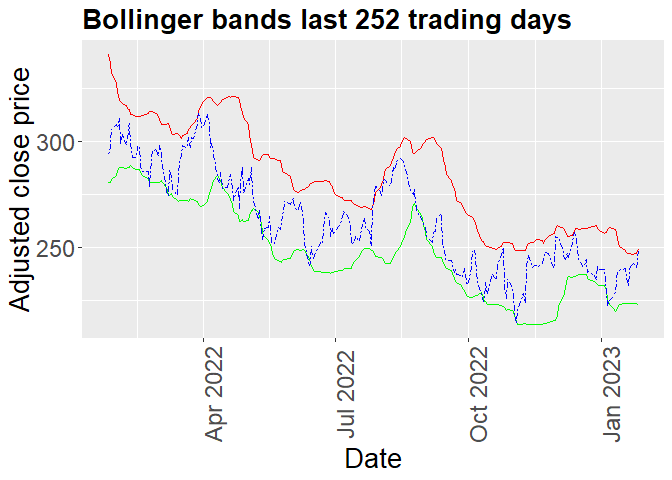
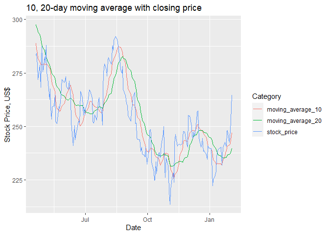
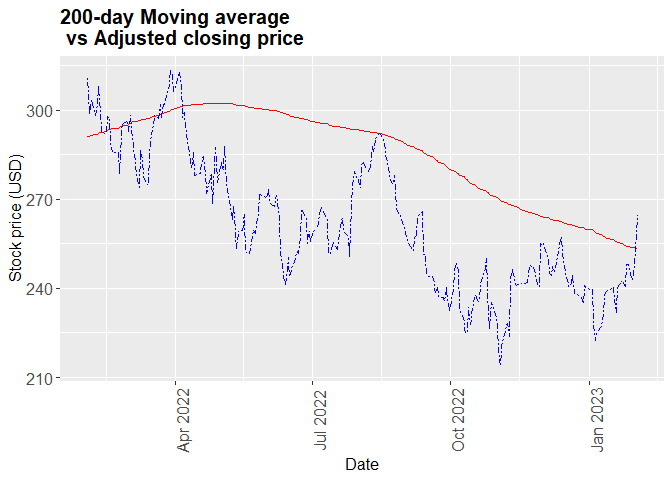

<!-- README.md is generated from README.Rmd. Please edit that file -->

## Authors

-   Ruslan Dimitrov
-   Robin Dhillon
-   Peng Zhang
-   Chenyang Wang

## stocksignalsr: Introduction

<!-- badges: start -->

[](https://github.com/UBC-MDS/stocksignalsr/actions/workflows/R-CMD-check.yaml)

<!-- badges: end -->

The goal of stocksignalsr is to be used as a starting point for
identifying stock buy/sell signals. Stock investing is a complex process
which requires ongoing efforts and there is no one formula or indicator
that works all the time. There exists extensive research on how to
identify opportunities and profit from stocks. Methodologies for
evaluating financial instruments range widely. An investor can utilize
macroeconomic research, fundamental analysis, news, analyst reports, or
technical analysis. In all those approaches numerical analysis is the
underlying common theme.

In this project, the team aims to evaluate three key technical
indicators that can be used to evaluate where the stock price is
relative to its historic performance. These indicators use only the
stock’s historic price and are by no means an exhaustive approach to
investing. These indicators are:

200-day price moving average 10 vs 20-day price moving average 20-day
Bollinger bands Typically when the market and stocks in particular are
trading below 200-day moving average, they are considered in a down
trend. When they trade above the 200-day moving average stocks are
considered in an uptrend. The 10-20 day indicator, indicates short term
price trend reversals, and can be utilized to trade stocks on a short
term basis. Finally, the Bollinger bands indicate whether a stock price
is above or below two standard deviations from its 20 day average price.
Bbands can be used as indicator for short term overbought/oversold
stocks.

## Package details

Package details The package consists of 6 functions:

-   `get_data`: The function downloads all available historic price data
    for a selected stock and saves it. It utilizes the tidyquant R
    package to automate the process.
-   `moving_average`: The function calculates a moving average, i.e. the
    average stock closing price over a specified period, which is passed
    as argument size in the function call. It uses the data saved via
    get_data.
-   `plot_ma_200days`: The function plots the 200-day moving average
    together with the stock price for a specified period. It uses the
    output from the function moving_average to plot the chart.
-   `plot_ma_10_20`: The function plots the 10 and 20-day moving average
    together with the stock price for a specified period. It uses the
    output from function moving_average to plot the chart.
-   `get_bbands`: The function calculates the 20 day Bollinger bands for
    the existing period of the data and returns a dataframe with the
    respective upper and lower band. It uses data saved via get_data.
-   `plot_bbands`: The function plots upper and lower Bollinger bands
    together with the stock closing price for over the past 252 trading
    days. It uses the output from function get_bbands to plot the chart.

## R ecosystem

There are multiple packages related to utilizing finance data. For
example, past projects in DSCI524 have explored various transformations
to help analyzing stocks like this one:
<https://github.com/UBC-MDS/stockAnalyzer>.

Our aim, however, is to explore specific technical analysis indicators
and streamline the process by providing a hands-on package which can be
used in daily stock analysis. Furthermore, this package will help
streamline the process in order to help automation of the basics of
stock screening.

## Installation

You can install the development version of stocksignalsr from
[GitHub](https://github.com/) with:

``` r
# install.packages("devtools")
devtools::install_github("UBC-MDS/stocksignalsr")
```

## Usage and Demonstration

``` r
library(stocksignalsr)
```

Please ensure that the directory in which the current directory is
located is not write protected, as data will be saved in that location.
You can use setwd() to change the location in which the console
operates.

In order to download price-volume data for a given stock ticker, run
function `get_data`. Data will be saved in csv file in the directory
containing your current working directory:

``` r
stock_ticker <- "MSFT"
get_data(stock_ticker, "1986-03-13")
```

Function `get_bbands` returns a data frame with calculations for upper
and lower Bollinger bands. The data frame contains columns:

-   `date` for which the data was collected
-   `adjusted` for the adjusted closing price on respective date
-   `mavg` for the moving average closing price over the last 20 days
-   `up`, `dn` for the respective upper and lower band

This data can be used as a trading indicator when compared to the
current price of the stock. In order to get the data run the function as
follows:

``` r
stock_ticker <- "MSFT"
bands <- get_bbands(stock_ticker)
tail(bands)
```

Function `moving_average` generates a data frame with the moving average
for the respective period in days entered in the function call. The data
frame contains two columns:

-   `date` for which the data was collected
-   `adjusted` representing the moving average for the respective
    period.

This data can be used as an indicator in combination with other factors
takaen into account by the user. The function can be used run as
follows.

``` r
stock_ticker <- "MSFT"
ma <- moving_average(stock_ticker, 20)
tail(ma)
```

In order to visualize a plot of the Bollinger bands for a stock, run
function `plot_bbands` as follows:

``` r
stock_ticker <- "MSFT"
plot_bbands(stock_ticker)
```



In order to visualize a plot of the 10 and 20-day moving average along
with the stock’s closing price, run function `plot_ma_10_20days` as
follows:

``` r
stock_ticker <- "MSFT"
plot_ma_10_20days(stock_ticker)
```



Finally, in order to visualize a plot of the 200-day moving average
along with the stock’s closing price, run function `plot_200ma` as
follows:

``` r
stock_ticker <- "MSFT"
plot_200ma(stock_ticker)
```


